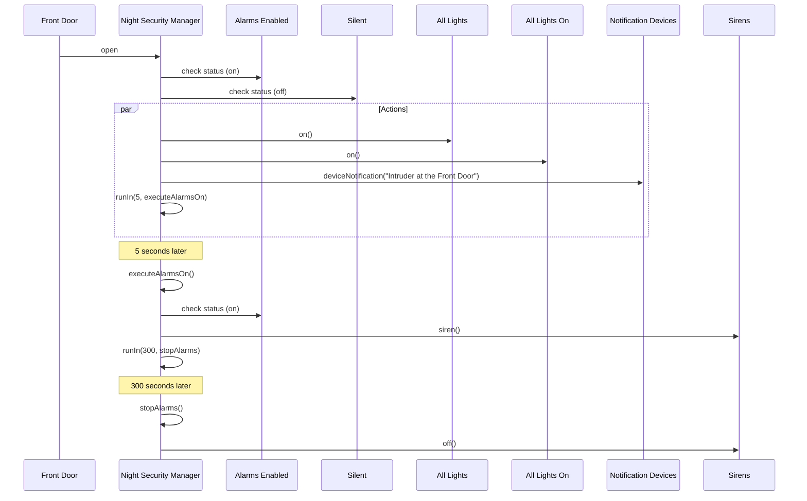
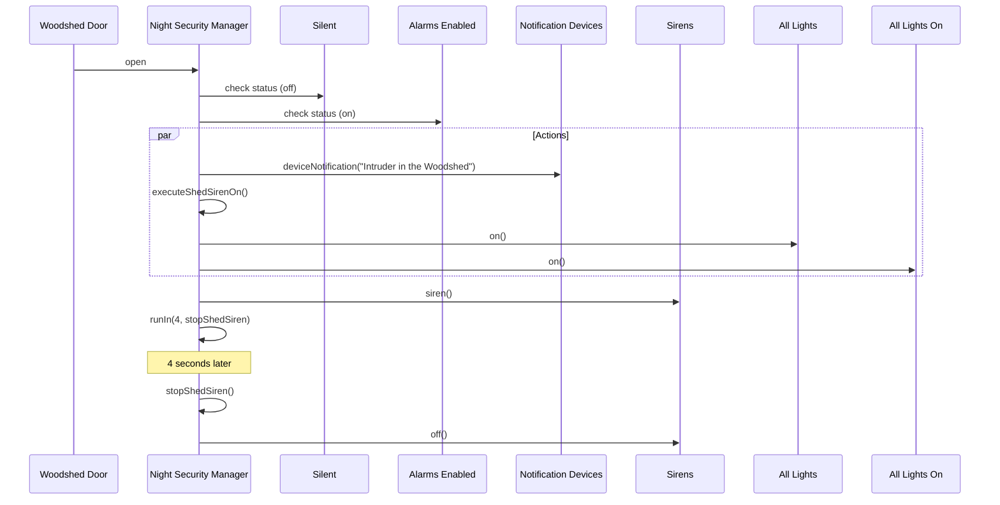

# Night Security Manager Sequence Diagrams

## Flow 1: Intruder at Front Door (Triggers Execute Alarms)

This flow demonstrates the sequence of events when the Front Door is opened, triggering the main alarm system.

## Flow 2: Intruder in Woodshed (Triggers Execute Shed Siren)

This flow demonstrates the sequence of events when the Woodshed Door is opened, triggering the shed siren (short duration).

